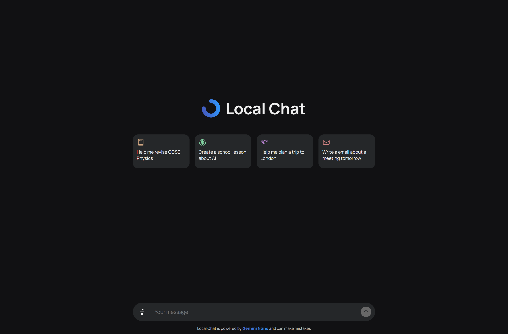

# Local Chat
Local Chat is a chat interface that uses Gemini Nano running locally on the clients machine.

Follow the steps bellow to make sure that it works:
<ol>
    <li>Be on Windows or Mac</li>
    <li>Download <a target="_blank" href="https://www.google.com/intl/en_uk/chrome/canary/">Chrome Canary</a></li>
    <li>Set <a href="chrome://flags/#optimization-guide-on-device-model" target="_blank">chrome://flags/#optimization-guide-on-device-model</a> to <strong>Enabled BypassPerfRequirement</strong></li>
    <li>Set <a href="chrome://flags/#prompt-api-for-gemini-nano" target="_blank">chrome://flags/#prompt-api-for-gemini-nano</a> to <strong>Enabled</strong></li>
    <li>Relaunch Chrome</li>
    <li>Go to <a href="chrome://components" target="_blank">chrome://components</a></li>
    <li>Find <strong>Optimization Guide On Device </strong> and click <strong>Check for update</strong> button and it should download the model</li>
</ol>

As this uses Gemini Nano which is a small model it means that there may be mistakes to make sure that you alway check important information.